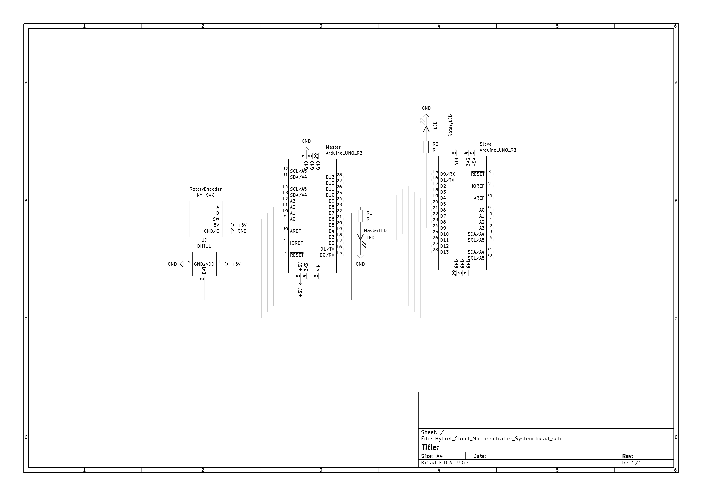

# Arduino Uno Master/Slave Serial Chain Test

This project tests this communication path:

`Laptop -> Arduino Master -> Arduino Slave`

using only each board's built-in LED on pin 13.

## Hardware wiring

- Master `TX (pin 1)` -> Slave `RX (pin 0)`
- Master `RX (pin 0)` <- Slave `TX (pin 1)`
- Master `GND` <-> Slave `GND`

## Files

- `arduino/master/master.ino`: listens for `'1'`, blinks master LED, sends `BLINK`
- `arduino/slave/slave.ino`: listens for `BLINK`, blinks slave LED
- `python/trigger_master.py`: sends trigger byte `'1'` to master USB serial port

## Upload

- Upload `arduino/master/master.ino` to the master Uno.
- Upload `arduino/slave/slave.ino` to the slave Uno.

## Python setup (Ubuntu)

Install pyserial:

```bash
sudo apt update
sudo apt install -y python3-serial
```

Run trigger script:

```bash
python3 python/trigger_master.py --port /dev/ttyACM0 --baud 9600
```

Use `dmesg | tail` or `ls -l /dev/ttyACM*` to confirm which port is the master.

## Linux serial permissions (Ubuntu)

Recommended permanent access (without sudo):

```bash
sudo usermod -aG dialout $USER
newgrp dialout
```

Then unplug/replug both Arduinos (or log out/in).

Temporary quick workaround (resets on reconnect/reboot):

```bash
sudo chmod a+rw /dev/ttyACM0 /dev/ttyACM1
```

Optional persistent udev rule:

```bash
sudo tee /etc/udev/rules.d/99-arduino.rules >/dev/null <<'EOF'
SUBSYSTEM=="tty", ATTRS{idVendor}=="2341", MODE="0666", GROUP="dialout"
SUBSYSTEM=="tty", ATTRS{idVendor}=="2a03", MODE="0666", GROUP="dialout"
EOF

sudo udevadm control --reload-rules
sudo udevadm trigger
```

## Expected behavior

When you run the Python script:

1. Master receives `'1'` from laptop and blinks LED.
2. Master sends `BLINK` over TX/RX to slave.
3. Slave receives `BLINK` and blinks LED.

## Note about Arduino Uno serial

On Uno, USB serial and pins 0/1 are the same hardware UART. For this simple chain test, this setup is fine. Avoid opening multiple serial clients on the same device at once.

## Schema Hardware a Sistemului

Mai jos este prezentată diagrama circuitului, care include comunicarea UART între cele două plăci Arduino, senzorul DHT11 și modulul Rotary Encoder:



📄 **[Descarcă schema completă în format PDF (pentru print/zoom)](hardware/Hybrid_Cloud_MIcrocontroller_System.pdf)**

## Testing with Azure IoT Hub (no WiFi module needed)

The Arduino Uno R3 has no built-in networking. The laptop acts as a **field gateway**: it reads real sensor data from the master over USB-serial and forwards it to Azure IoT Hub.

### How it works

```
DHT11 → Arduino Master → USB-Serial → Laptop (app.py) → Azure IoT Hub
                 ↑
         Arduino Slave (pot/LED)
```

The Azure bridge runs as a background thread inside `app.py`. It is disabled by default and activates only when `AZURE_IOT_CONNECTION_STRING` is set.

### Setup

1. **Install dependencies** (includes the Azure IoT Device SDK):
   ```powershell
   pip install -r python\requirements.txt
   ```

2. **Create a device in Azure IoT Hub**:
   - Azure Portal → your IoT Hub → **Devices** → **Add Device**
   - Copy the device's **Primary Connection String**
   - Format: `HostName=<hub>.azure-devices.net;DeviceId=<id>;SharedAccessKey=<key>`

3. **Set environment variables** (PowerShell):
   ```powershell
   $env:AZURE_IOT_CONNECTION_STRING = "HostName=...;DeviceId=...;SharedAccessKey=..."
   $env:ARDUINO_PORT = "COM7"                  # adjust to your port
   $env:AZURE_IOT_INTERVAL_SECONDS = "15"      # optional, default is 15 s
   ```

4. **Plug in the Arduino master** via USB (DHT11 on D7, slave wired on D10/D11).

5. **Run the app**:
   ```powershell
   python python\app.py
   ```
   You should see log lines like:
   ```
   Arduino connected.
   Data updated: Temp=22.50, Hum=48.10
   [azure] connected to IoT Hub.
   [azure] sent: {"temperature": "22.50", "humidity": "48.10", ...}
   ```

### Verifying messages arrive in Azure

**Option A — Azure Portal:**
IoT Hub → Overview → "Device to cloud messages" metric ticks up every 15 s.

**Option B — Azure CLI (live stream):**
```bash
az iot hub monitor-events --hub-name <your-hub-name>
```

**Option C — smoke test without Arduino (`python/test.py`):**
```powershell
$env:CONNECTION_STRING = "HostName=...;DeviceId=...;SharedAccessKey=..."
python python\test.py
```
Sends fake telemetry every 5 s — useful to verify the connection string is correct before plugging in hardware.

### Free-tier note

Azure IoT Hub free tier allows **8,000 messages/day**. At the default 15 s interval the bridge sends ~5,760 messages/day — safely within the limit. Lower the interval only if you need higher resolution data.

### Payload format

Each message is JSON:
```json
{
  "temperature": "22.50",
  "humidity": "48.10",
  "led_status": "ON",
  "slave_led_status": "OFF",
  "pot_value": "512",
  "ts": "2026-05-26T14:30:00"
}
```
